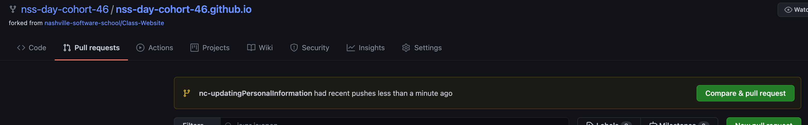
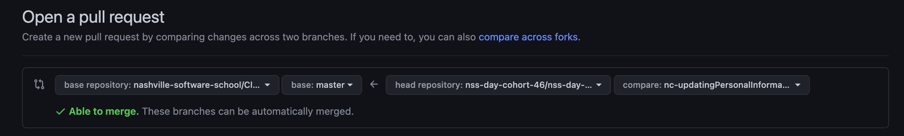
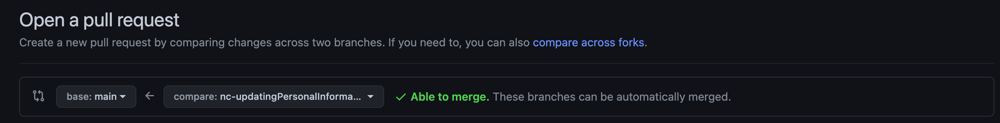

# Instructions on Making Changes

To Create a Pull Request for the Class Website:

Clone the repo into your workspace directory
```
cd ~/workspace
git clone git@github.com:nss-day-cohort-46/nss-day-cohort-46.github.io.git
```
Create a new branch with your initials and the thing you are changing:
Ex: If I am Nick A Carver and I am updating my personal information i would name my branch:
```
nac-updatingPersonalInformation
```
Make changes.
Push to github.
Create pull request



<strong>UPDATE THE BRANCH YOU ARE TRYING TO MERGE TO</strong>

Github defaults to this



Change to this



Ensure your code follows these guidelines:

[ ] If you have a blank field then type "null" <br>
[ ] The site still loads without breaking<br>
[ ] You are not affecting someone else's data

Things C46 Still Needs to Do:

[ ] Update our tech stack <br>
[ ] Take a class photo <br>
[ ] Update the eventbrite link


# Original Instructions From Base Repo

This is a simple template for NSS students to use to create their class website. Employers are looking for a simple website where they can easily see each students' quick summary and links to Github, LinkedIn, and website. Your class website should look nice and professional, but no need to get fancy. ;)

## To get started on the class website

1. Click on "Use This Template"
2. In the owner dropdown, choose your cohort's organization 
3. Name the repository after the organization, ie. if the cohort's organization is called nss-day-cohort-50 name the new repo `nss-day-cohort-50.github.io`
4. Clone the repo locally to start working
5. Update `data/cohort.json` with student information
6. Update images with your class's photos
7. Update `data/tech.json` with your cohort's tech stack
8. Update NSS Eventbrite link to the specific link for your class's demo day. Reach out to Mandy if you need the link.
9. Update the "Thanks" section in `index.html` to reflect who your cohort would like to thank.
10. Change anything else with styling you'd like!

This template was written using jQuery and Ajax, so the syntax might look a little different than what you're used to. If you have any questions about how to use the template or make changes to it, please reach out to an instructor and we'd be happy to help walk you through it.

## To Deploy

Deploy to Github Pages - no need for a custom domain.

[Directions to deploy to Github Pages](https://www.codecademy.com/articles/f1-u3-github-pages)

Mandy will then take your Github Pages URL and set up a redirect link - that redirect link is what employers will get (example: [www.nashss.com/cohort28](www.nashss.com/cohort28)). 
